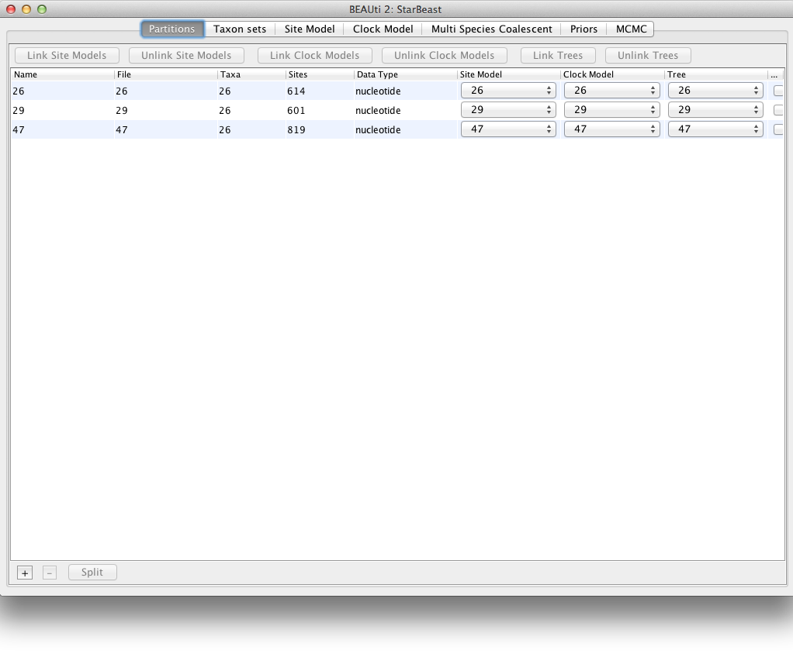
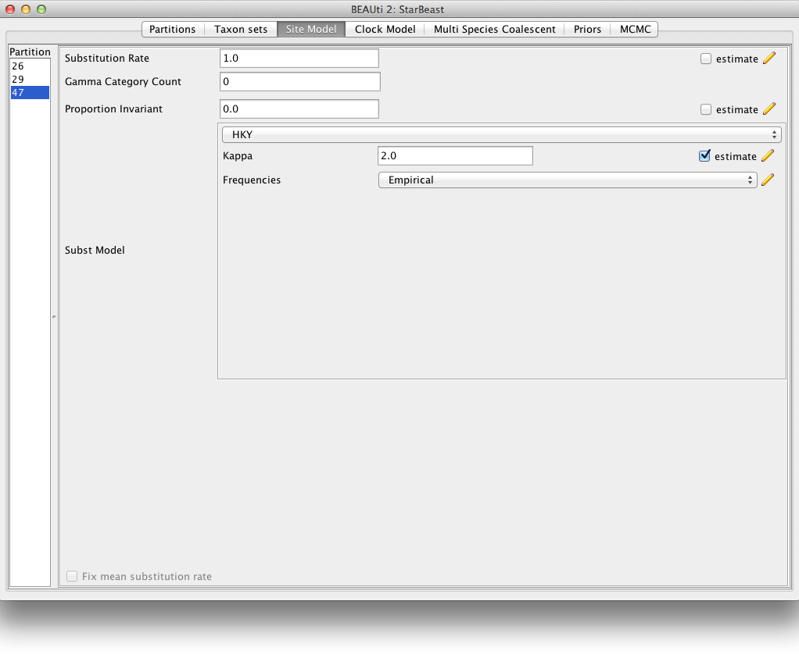
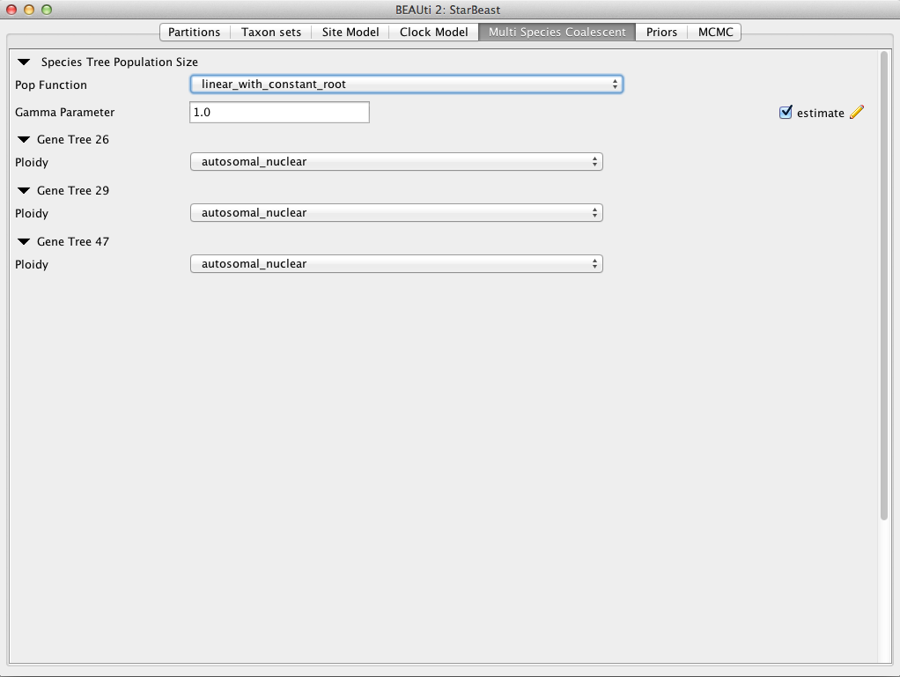
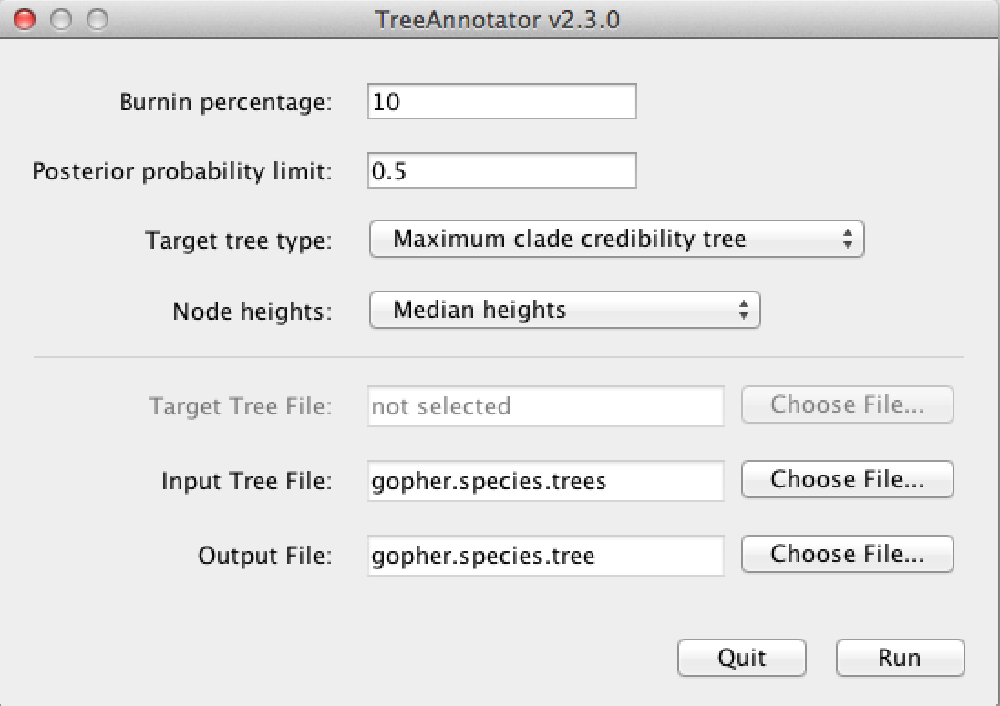
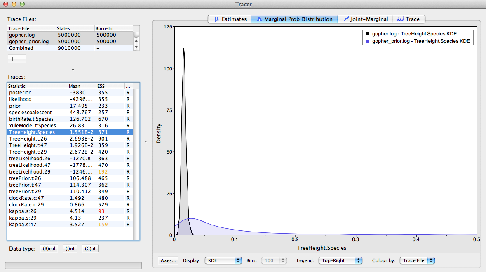

# Introduction

In this tutorial we describe a full Bayesian framework for species tree estimation. The statistical methodology described in this tutorial is known by the acronym *BEAST (pronounced "star beast") .

You will need the following software at your disposal:

-  **BEAST** - this package contains the BEAST program, BEAUti, TreeAnnotator and other utility programs. This tutorial is written for BEAST v{{ page.beastversion }}, which has support for multiple partitions. It is available for download from [http://beast2.org](http://beast2.org) .
-  **Tracer** - this program is used to explore the output of BEAST (and other Bayesian MCMC programs). It summarizes graphically and quantitively the distributions of continuous parameters and provides diagnostic information for the particular MCMC chain. At the time of writing, the current version is v{{ page.tracerversion }}. It is available for download from [http://tree.bio.ed.ac.uk/software/tracer](http://tree.bio.ed.ac.uk/software/tracer).
-  **FigTree** - this is an application for displaying and printing molecular phylogenies, in particular those obtained using BEAST. At the time of writing, the current version is v{{ page.figtreeversion }}. It is available for download from [http://tree.bio.ed.ac.uk/software/figtree](http://tree.bio.ed.ac.uk/software/figtree).

----

# *BEAST analysis

This tutorial will guide you through the analysis of three loci sampled from 26 individuals representing nine species of pocket gophers. This is a subset of previously published data . The objective of this tutorial is to estimate the species tree that is most probable given the multi-individual multi-locus sequence data. The species tree has nine taxa, whereas each gene tree has 26 taxa. *BEAST 2 will co-estimate three gene trees embedded in a shared species tree (see  for details).

The first step in the analysis will be to convert a NEXUS file with a `DATA` or `CHARACTERS` block into a BEAST XML input file. This is done using the program **BEAUti** (Bayesian Evolutionary Analysis Utility). This is a user-friendly program for setting the evolutionary model and options for the MCMC analysis. The second step will be to actually run BEAST using the XML input file that contains the data, model and MCMC chain settings. The final step will be to explore the output of BEAST in order to diagnose problems and to summarize the results.

## BEAUti

Start up BEAUti to set up the configuration file for the analysis.

### Set up BEAUti for *BEAST

BEAUti uses templates to populate the BEAST XML configuration file with the necessary elements. This template also allows BEAUti to set up the graphical user interface accordingly, having the right tabs and settings.

\*BEAST uses a non-standard template to generate the analysis XML, which means that to use BEAUti for \*BEAST, the first thing to do is to change the template. Choose the **File/Template/StarBeast** item ([Figure 1](#fig.template)). Keep in mind that when changing a template, BEAUti deletes all previously imported data and starts with a clean template. So, if you already loaded some data, a warning message will pop up indicating that this data will be lost if you switch templates.

<figure>
	<a id="fig.template"></a>
	
	<figcaption>Figure 1: Select a new template in BEAUti.</figcaption>
</figure>
<br>


### Loading the NEXUS file

\*BEAST is a multi-individual, multi-locus method. The data for each locus is stored as one alignment in its own NEXUS file. Taxa names in each alignment have to be unique, but duplicates across alignments are allowed.

To load a NEXUS format alignment, simply select the **Import Alignment** option from the **File** menu. Select three files called [26.nex](https://github.com/CompEvol/beast2/blob/master/examples/nexus/26.nex?raw=true), [29.nex](https://github.com/CompEvol/beast2/blob/master/examples/nexus/29.nex?raw=true), [47.nex](https://github.com/CompEvol/beast2/blob/master/examples/nexus/47.nex?raw=true) by holding `shift` key. 
You can find the files in the `examples/nexus` directory in the directory where BEAST was installed. 
Alternatively, click the links above to download the data. After the data is opened in your web browser each time, right click with the mouse and separately save them as `26.nex, 29.nex, 47.nex`.

Each file contains an alignment of sequences from an independent locus. The `26.nex` looks like this (content has been truncated):


``` 
#NEXUS
[TBO26oLong]
BEGIN DATA;
    DIMENSIONS  NTAX =26 NCHAR=614;
    FORMAT DATATYPE = DNA GAP = - MISSING = ?;
    MATRIX	
    Orthogeomys_heterodus        ATTCTAGGCAAAAAGAGCAATGC ...
    Thomomys_bottae_awahnee_a    ????????????????????ATGCTG ...
    Thomomys_bottae_awahnee_b    ????????????????????ATGCTG ...
    Thomomys_bottae_xerophilus   ????????????????????ATGCTG ...
    Thomomys_bottae_cactophilus  ????????????????AGCAATGCT ...
    ... ...
    ;
END;
```


Once loaded, the three partitions are displayed in the main panel.
You can double click any alignment (partition) to show its detail.
[Figure 2](#fig.datapartition) shows the way BEAUti looks after loading the appropriate alignments.

<figure>
	<a id="fig.datapartition"></a>
	
	<figcaption>Figure 2: Data partition panel after loading alignments.
</figcaption>
</figure>
<br>


For multi-locus analyses, BEAST can link or unlink substitutions models across the loci by clicking buttons on the top of **Partitions** panel. The default of *BEAST is unlinking all models: substitution model, clock model, and tree models. For this tutorial we shall leave all models unlinked.

Note that you should only unlink the tree model across data partitions that are actually genetically unlinked. For example, in most organisms all the mitochondrial genes are effectively linked due to a lack of recombination and they should be set up to use the same tree model in a *BEAST analysis. It could also be that for this analysis a linked model would perform better.

### Guess or import trait(s) from a mapping file

Each taxon in a \*BEAST analysis is associated with a species. Typically, the species name is already embedded inside the taxon. The species name should be easy to extract; place it either at the beginning or the end, separated by a "special" character which does not appear in names. For example, `aria_334259`, `coast_343436` (using an underscore) or `10x017b.wrussia`, `2x305b.eastis` (using a dot).

We need to tell BEAUti somehow which lineages in the alignments go with taxa in the species tree. Select the **Taxon Set** panel, and a list of taxa from the alignments is shown together with a default guess by BEAUti. In this case, the guess is not very good, so we want to change this. You can either change each of the entries in the table manually, have a mapping stored in a file or have BEAUti guess the taxon names. 

If the mapping is to be read from a file one needs to specify a proper trait file. The first row is always specified as the keyword `traits` in the first column followed by the keyword `species` in the second column, separated by tab. The rest of the rows map each individual taxon name to a species name; the taxon name in the first column and species name in the second column separated by tab. For example:


``` 
traits	species
taxon1	speciesA
taxon2	speciesA
taxon3	speciesB
... ...
```

Alternatively, pressing the **Guess** button in BEAUti, a dialog is shown where you can choose from several ways to try to detect the species from the name of the taxon. In our case, splitting the name on the underscore character (_) and selecting the second group will give us the mapping that we need ([Figure 3](#fig.taxonset)).

<figure>
	<a id="fig.taxonset"></a>
	
	<figcaption>Figure 3: Selecting taxon sets in BEAUti using the guess dialog from the Taxon set panel.</figcaption>
</figure>
<br>


### Setting up the substitution model

The next thing to do is to click on the **Site Model** tab at the top of the main window. This will reveal the evolutionary model settings for BEAST. Exactly which options appear depends on whether the data are nucleotides, amino acids, binary data, or general data.
The settings that appear after loading the dataset are always the default values.

Thus, we have to pick a substitution model that will work better on real data than the default JC69.
For this analysis, we select each partition of the data on the left side of the panel and set up the same substitution model for all three partitions: `HKY` for **Substitution Model** and `Empirical` for the **Frequencies** ([Figure 4](#fig.sitemodel)).

<figure>
	<a id="fig.sitemodel"></a>
	
	<figcaption>Figure 4: Setting up substitution and site models for the gopher alignments.</figcaption>
</figure>
<br>


### Setting up the clock model

Then, click on the **Clock Model** tab at the top of the main window. In this analysis, we use the `Strict Clock` molecular clock model.
Your model options should now look as displayed in [Figure 5](#fig.clockmodel). 

<figure>
	<a id="fig.clockmodel"></a>
	
	<figcaption>Figure5: Setting up clock models for the gopher alignments.</figcaption>
</figure>
<br>


The **estimate** check box is unchecked for the first clock model and checked for the rest clock models, because we wish to estimate the substitution rate of each subsequent locus relative to the first locus whose rate is fixed to 1.0.

### Multi Species Coalescent

The **Multi Species Coalescent** panel allows settings of the multi-species coalescent model to be specified. Users can only configure the species tree prior, not the gene tree priors, which are automatically specified by the multispecies coalescent.
Currently, three population size models for species tree (under the entry **Pop Function**) are available: `Continuous-linear and constant root`, `Continuous-linear`, and `Constant`. In this analysis, since we don't have much information for the population change at the root, we use `linear and constant root` model.
In \*BEAST, the population sizes are assigned gamma priors, and users cannot change the type to a different distribution. But the scale parameter of the gamma prior (called **Population Mean**) can be assigned a hyperprior (tick **estimate**, [Figure 6](#fig.MSP)).

The **Ploidy** item determines the type of sequence (mitochondrial, nuclear, X, Y). This matters since different modes of inheritance give rise to different effective population sizes, for example in the case of mitochondrial DNA we would only deal with the half of the available population, since this type of DNA is only passed on by the mother. In the case of this analysis the data is autosomal nuclear, which is the default option ([Figure 6](#fig.MSP)).

<figure>
	<a id="fig.MSP"></a>
	
	<figcaption>Figure 6: Setting up the multi species coalescent model parameters.</figcaption>
</figure>
<br>


### Priors

The **Priors** panel allows priors for each parameter in the model to be specified. 

Several models are available as species tree priors, however, only the Yule or the birth-death model are suitable for *BEAST analyses. Leave the tree prior setting at the default `Yule Model`. This prior specifies the distribution of the speciation times.

The default priors that BEAST sets for other parameters would allow the analysis to work. However, some of these are inappropriate for this analysis. Therefore change the priors as follows:

-  **birthRate.t:Species**: set the prior to `Log Normal` with **M** of  4.0  and **S** of 1.25;
-  **popMean** (scale parameter of the gamma priors for population sizes): set the prior to `Log Normal` with **M** of -5.0 and **S** of 1.2; 
-  **clockRate.c:29**: set the prior to `Exponential` with **mean** 1.0;
-  **clockRate.c:45**: set the prior to `Exponential` with **mean** 1.0.

The resulting configuration is shown in [Figure 7](#fig.priors).

<figure>
	<a id="fig.priors"></a>
	
	<figcaption>Figure 7: Setting up parameter priors.</figcaption>
</figure>
<br>


### Operators

The **Operators** panel (normally hidden) is used to configure technical settings that affect the efficiency of the MCMC program. In MCMC the operators define which values will be proposed for the next step in the chain given the current state. You can take a look at them if you go to **View/Show Operators panel**, but do not edit the settings.

### Setting the MCMC options

The next tab, **MCMC**, provides more general settings to control the length of the MCMC and the file names. 

First, we need to set the **Chain Length**. This is the number of
steps the MCMC will make in the chain before finishing. The appropriate length of the chain depends on the size of the dataset, the complexity of the model and the accuracy of the answer required. The default value of 10,000,000 is entirely arbitrary and should be adjusted according to the size of your dataset. For this dataset let's set the chain length to **5,000,000** as this will run reasonably quickly on most modern computers (a few minutes).

The next options specify how often should the parameter values in the Markov chain be displayed on the screen and recorded in the log file.
The screen output is simply for monitoring the program's progress and can thus be set to any value (although if set too small, i.e. if displaying on screen too often, the sheer quantity of information being displayed on the screen will actually slow the program down). For the log file, the value should be set relative to the total length of the chain. Sampling too often will result in very large files with little extra benefit in terms of the precision of the analysis. Sample too infrequently and the log file will not contain much information about the distributions of the parameters. 
You probably want to aim to store no more than 10,000 samples so the log frequency should be set to no less than **5,000,000 / 10,000 = 500**.

For this exercise we will set the the **tracelog** to **5,000** and the **screenlog** to **10,000**. 
Set the file name of the **tracelog** to `gopher.log`, that of the **speciesTreeLogger** to `gopher.species.trees`, and that of the **treelog.t:26, treelog.t:29, treelog.t:47** to `gopher.gene$(tree).trees`.

The resulting configuration is shown in [Figure 8](#fig.MCMC).

<figure>
	<a id="fig.MCMC"></a>
	
	<figcaption>Figure 8: Setting up the MCMC parameters.</figcaption>
</figure>
<br>


If you are using Windows then we suggest you add the suffix `.txt` to both of these files (i.e. to specify output file names to `gopher.log.txt` and `gopher.species.trees.txt`) so that Windows recognizes these as text files. 

### Generating the BEAST XML file 

We are now ready to create the BEAST XML file. To do this, either select the **File/Save** or **File/Save As** option from the **File** menu. Save the file with an appropriate name (we usually end the filename with `.xml`, i.e. `gopher.xml`). We are now ready to run the file through BEAST. 

## BEAST

Now run BEAST. Provide your newly created XML file as input by clicking **Choose File ...**, and then click **Run** ([Figure 9](#fig.BEAST)).

BEAST will then run until the specified chain length is reached, and until it has finished reporting information on the screen. The actual result files are saved to the disk in the same location as your input file. The output to the screen will look something like this: 

<figure>
	<a id="fig.BEAST"></a>
	
	<figcaption>Figure 9: Launching BEAST.</figcaption>
</figure>
<br>


``` 

                      BEAST v2.4.2, 2002-2016
             Bayesian Evolutionary Analysis Sampling Trees
                       Designed and developed by
 Remco Bouckaert, Alexei J. Drummond, Andrew Rambaut & Marc A. Suchard
                                    
                     Department of Computer Science
                         University of Auckland
                        remco@cs.auckland.ac.nz
                        alexei@cs.auckland.ac.nz
                                    
                   Institute of Evolutionary Biology
                        University of Edinburgh
                           a.rambaut@ed.ac.uk
                                    
                    David Geffen School of Medicine
                 University of California, Los Angeles
                           msuchard@ucla.edu
                                    
                      Downloads, Help & Resources:
                           http://beast2.org/
                                    
  Source code distributed under the GNU Lesser General Public License:
                   http://github.com/CompEvol/beast2
                                    
                           BEAST developers:
   Alex Alekseyenko, Trevor Bedford, Erik Bloomquist, Joseph Heled, 
 Sebastian Hoehna, Denise Kuehnert, Philippe Lemey, Wai Lok Sibon Li, 
Gerton Lunter, Sidney Markowitz, Vladimir Minin, Michael Defoin Platel, 
                 Oliver Pybus, Chieh-Hsi Wu, Walter Xie
                                    
                               Thanks to:
          Roald Forsberg\includeimage, Beth Shapiro and Korbinian Strimmer

... ...

        4980000     -3827.2093       279.2        -4293.2486        22.1146 24s/Msamples
        4990000     -3842.9689       276.3        -4295.6213        17.6877 24s/Msamples
        5000000     -3798.1962       278.2        -4280.7865        22.0904 24s/Msamples

Operator                                           Tuning    #accept    #reject      Pr(m)  Pr(acc|m)
NodeReheight(Reheight.t:Species)                        -     205317     486572     0.1386     0.2967 
ScaleOperator(popSizeBottomScaler.t:Species)       0.1902      10224      26338     0.0074     0.2796 
ScaleOperator(popMeanScale.t:Species)              0.4890       5795      16242     0.0044     0.2630 
UpDownOperator(updown.all.Species)                 0.5029      38885     108717     0.0295     0.2634 
ScaleOperator(YuleBirthRateScaler.t:Species)       0.2416       7155      15125     0.0044     0.3211 
ScaleOperator(treeScaler.t:26)                     0.7580       8510      42962     0.0102     0.1653 
ScaleOperator(treeRootScaler.t:26)                 0.4424      11487      39392     0.0102     0.2258 
Uniform(UniformOperator.t:26)                           -     287517     225590     0.1024     0.5603 
SubtreeSlide(SubtreeSlide.t:26)                    0.5560        418     256419     0.0512     0.0016 Try decreasing size to about 0.278
Exchange(narrow.t:26)                                   -     115438     140923     0.0512     0.4503 
Exchange(wide.t:26)                                     -       1363      49988     0.0102     0.0265 
WilsonBalding(WilsonBalding.t:26)                       -       1882      49890     0.0102     0.0364 
ScaleOperator(StrictClockRateScaler.c:29)          0.4744      13355      37595     0.0102     0.2621 
ScaleOperator(treeScaler.t:29)                     0.7567       8137      42785     0.0102     0.1598 
ScaleOperator(treeRootScaler.t:29)                 0.4101      12191      38887     0.0102     0.2387 
Uniform(UniformOperator.t:29)                           -     296262     216280     0.1024     0.5780 
SubtreeSlide(SubtreeSlide.t:29)                    0.5724        339     255443     0.0512     0.0013 Try decreasing size to about 0.286
Exchange(narrow.t:29)                                   -     117912     138109     0.0512     0.4606 
Exchange(wide.t:29)                                     -       2229      49303     0.0102     0.0433 
WilsonBalding(WilsonBalding.t:29)                       -       2459      49001     0.0102     0.0478 
UpDownOperator(updown.29)                          0.7793      10314      40694     0.0102     0.2022 
ScaleOperator(StrictClockRateScaler.c:47)          0.5490      12974      38097     0.0102     0.2540 
ScaleOperator(treeScaler.t:47)                     0.7363       8746      42523     0.0102     0.1706 
ScaleOperator(treeRootScaler.t:47)                 0.4742       7774      43670     0.0102     0.1511 
Uniform(UniformOperator.t:47)                           -     276942     234361     0.1024     0.5416 
SubtreeSlide(SubtreeSlide.t:47)                    0.5044        307     255119     0.0512     0.0012 Try decreasing size to about 0.252
Exchange(narrow.t:47)                                   -      91846     164747     0.0512     0.3579 
Exchange(wide.t:47)                                     -        731      50281     0.0102     0.0143 
WilsonBalding(WilsonBalding.t:47)                       -        937      50377     0.0102     0.0183 
UpDownOperator(updown.47)                          0.7397      10853      40537     0.0102     0.2112 
UpDownOperator(strictClockUpDownOperator.c:47)     0.7278       9987      41373     0.0102     0.1945 
UpDownOperator(strictClockUpDownOperator.c:29)     0.7761      10040      40724     0.0102     0.1978 
ScaleOperator(KappaScaler.s:26)                    0.3401        469       1197     0.0003     0.2815 
ScaleOperator(KappaScaler.s:29)                    0.2955        436       1231     0.0003     0.2615 
ScaleOperator(KappaScaler.s:47)                    0.3199        379       1298     0.0003     0.2260 
ScaleOperator(popSizeTopScaler.t:Species)          0.1910      23665      54936     0.0157     0.3011 

     Tuning: The value of the operator's tuning parameter, or '-' if the operator can't be optimized.
    #accept: The total number of times a proposal by this operator has been accepted.
    #reject: The total number of times a proposal by this operator has been rejected.
      Pr(m): The probability this operator is chosen in a step of the MCMC (i.e. the normalized weight).
  Pr(acc|m): The acceptance probability (#accept as a fraction of the total proposals for this operator).


Total calculation time: 135.584 seconds
End likelihood: -3798.196207797654

```

----

# Analyzing the results

## Tracer

Run the program called **Tracer** to analyze the output of BEAST. When the main window has opened, choose **Import Trace File...** from the **File** menu and select the file that BEAST has created called `gopher.log`.
You should now see a window looking like the snapshot in [Figure 10](#fig.tracer1).

<figure>
	<a id="fig.tracer1"></a>
	
	<figcaption>Figure 10: Tracer with the gopher data.</figcaption>
</figure>
<br>


Remember that MCMC is a stochastic algorithm so the actual numbers will not be exactly the same.

On the left-hand side is a list of the different quantities that BEAST has logged. There are traces for the posterior (this is the log of the product of the likelihood and the prior probabilities), and the continuous parameters. Selecting one trace from this list on the left-hand side brings up analyses for this trace on the right-hand side. When a file is first opened in Tracer, the `posterior` trace is selected and various statistics of this trace are shown under the **Estimates** tab (top window on the right-hand side). 

Tracer will plot a (marginal posterior) distribution for the selected parameter and also give you statistics such as the mean and median. The `95% HPD lower` or `upper` stands for *highest posterior density interval* and represents the most compact interval on the selected parameter that contains 95% of the posterior probability. It can be thought of as a Bayesian analog to a confidence interval. 

Select the three `TreeHeight` traces (hold `shift key while selecting). This will display the
age of the root for the three gene trees. If you switch the tab at the top of the window on the right-hand side to **Marginal Prob Distribution** then you will get a plot of the marginal posterior densities of each of these date estimates overlayed ([Figure 11](#fig.tracer2)).

<figure>
	<a id="fig.tracer2"></a>
	
	<figcaption>Figure 11: Tracer showing the root heights of the lineage trees.</figcaption>
</figure>
<br>


## TreeAnnotator

BEAST also produces a sample of plausible trees. 
These can be summarized using the program **TreeAnnotator**. This program will take the set of trees and identify a single tree that best represents the posterior distribution. It will then annotate this selected tree topology with the mean ages of all the nodes as well as the 95% HPD interval of divergence times for each clade in the selected tree. It will also calculate the posterior clade probability for each node. Run the TreeAnnotator program and set it up as shown in [Figure 12](#fig.TreeAnnotator).

<figure>
	<a id="fig.TreeAnnotator"></a>
	
	<figcaption>Figure 12: Using TreeAnnotator to summarise the tree set.</figcaption>
</figure>
<br>


The **Burnin percentage** is the number of trees to remove from the start of the sample. Unlike in Tracer where burnin is specified as the number of steps, in TreeAnnotator you need to specify the percentage of trees discarded. For this run, we set the burnin to 10 (i.e. we remove first 10% of the trees).

The **Posterior probability limit** option specifies a limit such that if a node is found at less than this frequency in the sample of trees (i.e., has a posterior probability less than this limit), it will not be annotated. Setting this to zero will annotate all nodes. For this analysis, set it to 0.5. This means that only the nodes seen in the majority of trees will be annotated. 

For **Target tree type** you can either choose a specific tree from a file or ask TreeAnnotator to find a tree in your sample. The default option, `Maximum clade credibility tree`, finds the tree with the highest product of the posterior probability of all its nodes.

Choose `Median heights` for **Node Heights**. This sets the heights (ages) of each node in the tree to the median height across the entire sample of trees for that clade.

For the input file, select the trees file that BEAST created (in this tutorial this was the `gopher.species.trees`) and select a file for the output (here we called it `gopher.species.tre`).

Now press **Run** and wait for the program to finish.

## Viewing the species tree

Finally, we can look at the tree in another program called **FigTree**. Run this program, and open the `gopher.species.tre` file by using the **Open** command in the **File** menu. The tree should appear.
You can now try selecting some of the options in the control panel on the left. Tick the **Node Bars** and try to get node age error bars. Also turn on **Branch Labels** and select `posterior` to get it to display the posterior probability for each node. Under **Appearance** you can also tell FigTree to colour the branches by the `posterior.
You should end up with a tree similar to one displayed in [Figure 13](#fig.figtree).

<figure>
	<a id="fig.figtree"></a>
	
	<figcaption>Figure 13: Figtree representation of the gopher species tree.</figcaption>
</figure>
<br>


Alternatively, you can load the species tree set `gopher.species.trees` into **DensiTree** and visualize it with following settings.

-  Perhaps, the intensity of the individual trees is not high enough, so you might want to increase it by clicking the icon **Increase Intensity of Trees** in the button bar at the top. The text for each button shows when you hover over it. 

-  Set **Burn in** to 500 trees. If before you had a collapsed trees, after this setting the tree should not be collapsed anymore.

-  **Show** a root-canal tree to better guide the eye over the set of trees. 

-  In **Clades** menu, select **Show clades** and display their mean and 95% HPD graphically, and posterior support using text. By default you may not be able to select the **Show clades** option. If that is the case, first click on the icon **Central** in the top right corner of the window.<br>You can see that there is information for too many clades being displayed. As most clades have very little support, they are not of interest and we would like to stop visualizing the information for those. Tick **Selected only**, then open the clade toolbar (menu **Window/View clade toolbar**), and select only highly supported clades (hold down the `shift` key to select several clades at a time). Also, select the clade consisting of *heterodus, bottae, umbinus* and *townsendii*, to show that *heterodus* is an outgroup of the tree,
but there is some support ( 17%) that it is not.

-  Drag the clades *monticola* and *idahoensis* up in the displayed tree so that the 95% HPD bar does not overlap with the one for *mazama, monticola, idahoensis* and *talpoidis*. Increase font size of the label for better readability (i.e. change the **Label** options).

You should now see an image similar to [Figure 14](#fig.DensiTree).

<figure>
	<a id="fig.DensiTree"></a>
	
	<figcaption>Figure 14: DensiTree representation of the species tree.</figcaption>
</figure>
<br>


**DensiTree** can be used to show the population sizes of the each of the trees from `gopher.species.trees` as branch widths. 
Under **Line Width**, select `BY_METADATA_PATTERN` option, for both upper and lower spinners and use `.*dmv=.(^,*).*` for the upper (start of the branch) pattern and `.*dmv=.^,*,(^\}*).*` for the lower (end of the branch) pattern.

This gives us visualisation as seen in [Figure 15](#fig.DensiTree.part3).

<figure>
	<a id="fig.DensiTree.part3"></a>
	
	<figcaption>Figure 15: DensiTree representation of the consensus species tree with population sizes indicated as line widths.</figcaption>
</figure>
<br>


Similarly, DensiTree can be used to show the population sizes of the summary tree `gopher.species.tre` from TreeAnnotator.
Load this file to DensiTree and explore the options in the spinners under **Line Width**. Notice, that `dmt` stands for `demographic times`, `dmv` for `demographic values`. These are the population parameters that are estimated for each node in the tree. With the continous-linear population size model, the first value `dmv1` is the population size at the branch start and the second `dmv2` is the population size at the branch end; where start and end are relative to going *backwards* in time, that is start is the more recent time, end the more ancient.

Choose `dmv1` for the upper (start/bottom of a branch) and `dmv2` for the lower spinner (end/top of a branch).
The resulting tree should look like the one in the left picture in [Figure 16](#fig.DensiTree.part1). 
You can see that at the nodes, the population size estimates do not quite match.
This is true for the areas of the tree with little posterior support for the clades (see [Figure 14](#fig.DensiTree) to check which clades have little support). In the right picture in [Figure 16](#fig.DensiTree.part1) the top is matched up with the bottom of the branch above (more ancestral), using the `Make fit to bottom` option for the lower spinner. This looks a bit prettier, but may not be quite accurate.

<figure>
	<a id="fig.DensiTree.part1"></a>
	
	<figcaption>Figure 16: DensiTree representation of the consensus species tree from TreeAnnotator.</figcaption>
</figure>
<br>


Alternatively to TreeAnnotator, a consensus tree can be generated by [biopy](https://github.com/jheled/biopy). An example is shown in [Figure 17](#fig.DensiTree.part2) where 1-norm option has been applied to generate the left picture, and 2-norm to obtain the right picture.

<figure>
	<a id="fig.DensiTree.part2"></a>
	
	<figcaption>Figure 17: DensiTree representation of the consensus species tree from biopy.</figcaption>
</figure>
<br>


## Comparing your results to the prior

Using BEAUti, set up the same analysis but under the **MCMC** options, select the **Sample From Prior** option. Re-run the analysis with BEAST. This will allow you to visualize the full prior distribution in the absence of your sequence data. Summarize the trees from the full prior distribution and compare the summary to the posterior summary tree.

You can also compare the log files from both analyses by loading the log file from the actual analysis and the log file from the prior sampling run into Tracer. Then select both of the files on the left side using the `shift` key. Now you can select different statistics from the traces and compare their marginal probability distributions. Note that Tracer will not allow you to compare any of the likelihoods as they are always `NaN` (not a number) in the case of prior sampling.

<figure>
	<a id="fig.tracerPrior"></a>
	
	<figcaption>Figure 18: Tracer showing the comparison between the prior and posterior distribution of the species tree height.</figcaption>
</figure>
<br>


[Figure 18](#fig.tracerPrior) shows an example of comparing the traces of the species tree height. From the plot we can conclude that the sequences contain quite a bit of information about this parameter, as the posterior moved away from the prior and is much more focused on a specific value.

----

The content of this tutorial is based on the [*BEAST in BEAST 2.0](https://github.com/CompEvol/beast2/blob/master/doc/tutorials/STARBEAST/StarBEASTTutorialv2.0.3.pdf?raw=true) tutorial by Joseph Heled, Remco Bouckaert, Alexei J. Drummond and Walter Xie. 

----

# Relevant References



